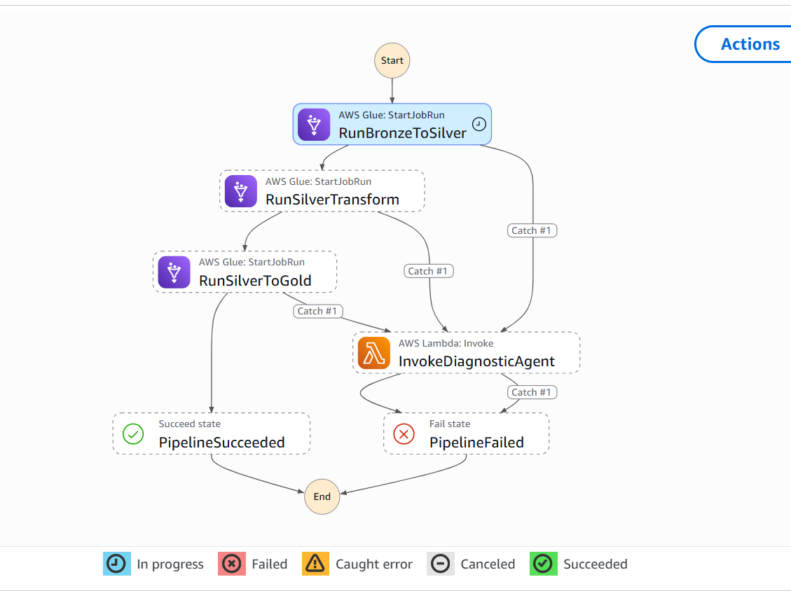
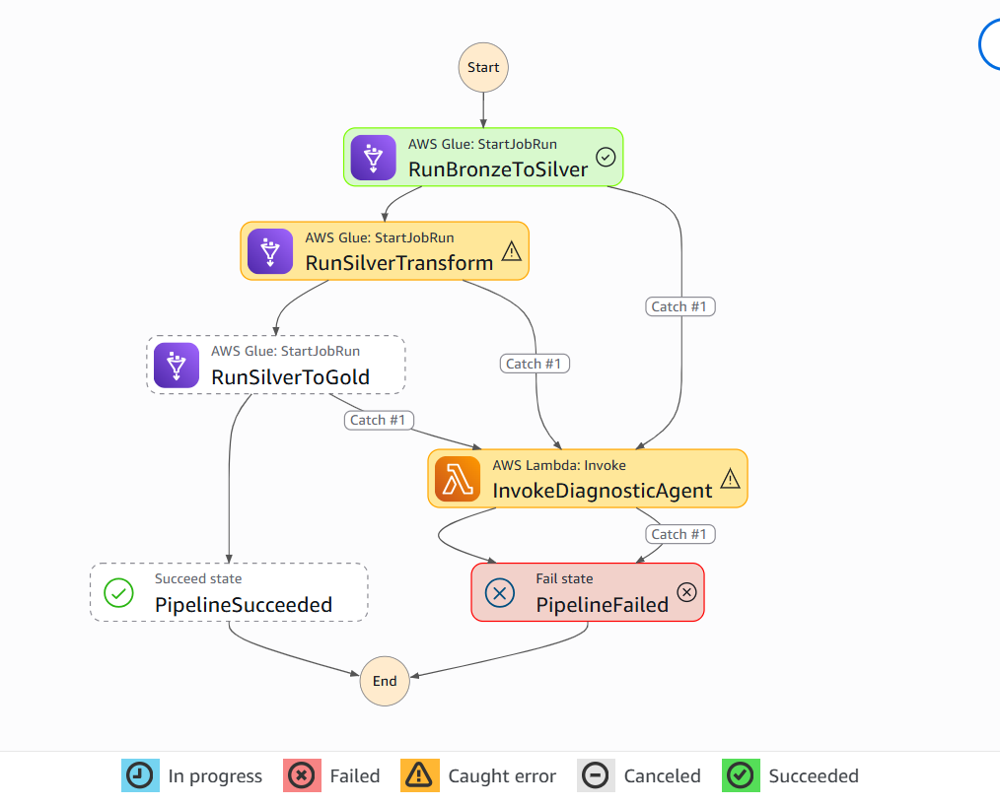
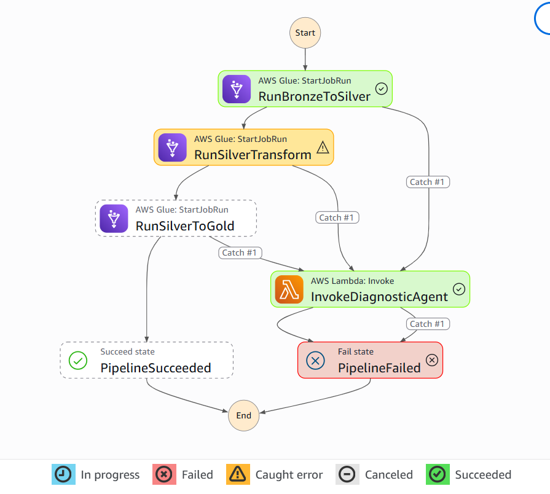
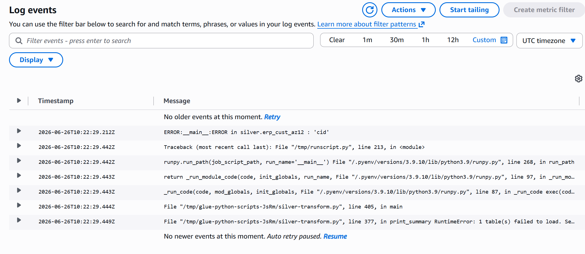
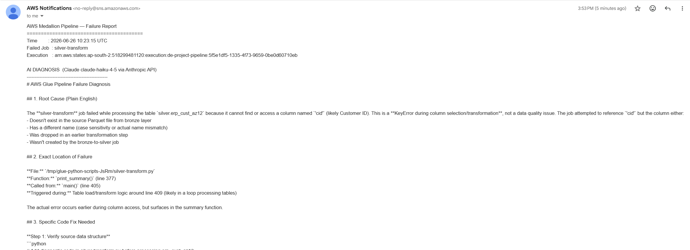
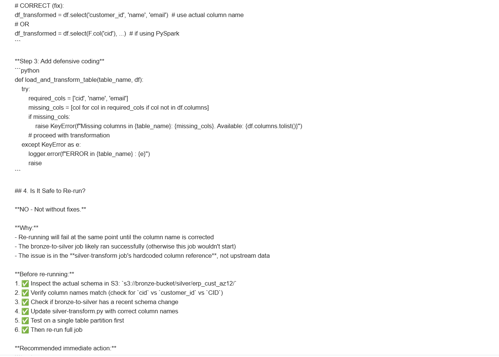

# AWS Medallion Architecture Data Pipeline

A cloud-native data engineering pipeline built on AWS that migrates a SQL Server data warehouse to a fully serverless architecture using the Medallion (Bronze → Silver → Gold) pattern.

---

## Overview

This project rebuilds a SQL Server Medallion Architecture data warehouse on AWS, replacing stored procedures with Python-based AWS Glue jobs and a fully automated event-driven pipeline. Source data from CRM and ERP systems flows through three layers of transformation before landing in S3 as a queryable star schema accessible via Amazon Athena.

| Layer  | Storage          | Format  | Purpose                            |
|--------|------------------|---------|------------------------------------|
| Bronze | S3               | CSV     | Raw source files, no transformation |
| Silver | S3               | Parquet | Cleaned, deduplicated, typed data  |
| Gold   | S3 + Glue Catalog | Parquet | Star schema, analytics-ready       |

**Pipeline runtime:** ~4 minutes end-to-end  
**Gold layer output:** 18,484 customers · current products · 60,398 sales facts

---

## Architecture

### Step Functions State Machine



```
┌───────────────────────────────────────────────────────────────────── ┐
│                        EVENT TRIGGER                                 │
│                                                                      │
│   CSV Upload ──► S3 Bronze ──► S3 Event Notification                 │
│                                       │                              │
│                                       ▼                              │
│                                  AWS Lambda                          │
│                              (pipeline trigger)                      │
│                                       │                              │
│                                       ▼                              │
│                             AWS Step Functions                       │
│                             (pipeline orchestrator)                  │
│                                       │                              │
│              ┌────────────────────────┼────────────────────────┐     │
│              ▼                        ▼                        ▼     │
│         Glue Job 1              Glue Job 2               Glue Job 3  │
│       Bronze → Silver         Silver Transform          Silver → Gold│
│    (CSV to Parquet)           (clean & enrich)         (star schema) │
│              │                        │                        │     │
│              ▼                        ▼                        ▼     │
│         S3 Silver               S3 Silver               S3 Gold      │
│                                                               │      │
│                                                               ▼      │
│                                                     Glue Data Catalog│
│                                                               │      │
│                                                               ▼      │
│                                                        Amazon Athena │
│                                                   (SQL on Gold layer)│
└─────────────────────────────────────────────────────────────────────┘
```

### Data Flow

```
CRM System                    ERP System
    │                              │
    ├── cust_info.csv              ├── CUST_AZ12.csv
    ├── prd_info.csv               ├── LOC_A101.csv
    └── sales_details.csv         └── PX_CAT_G1V2.csv
              │                              │
              └──────────────┬───────────────┘
                             ▼
                    S3 Bronze Bucket
                  (de-project-bronze-*)
                             │
                    [Glue Job 1: bronze_to_silver]
                             │
                             ▼
                    S3 Silver Bucket
                  (de-project-silver-*)
                             │
                    [Glue Job 2: silver_transform]
                             │
                             ▼
                    S3 Silver Bucket (transformed)
                             │
                    [Glue Job 3: silver_to_gold_s3]
                             │
                             ▼
              ┌──────────────┼──────────────┐
              ▼              ▼              ▼
       dim_customers   dim_products    fact_sales
        (18,484 rows)                 (60,398 rows)
              │              │              │
              └──────────────┴──────────────┘
                             │
                    S3 Gold Bucket + Glue Catalog
                  (de-project-gold-*)
                             │
                             ▼
                      Amazon Athena
```

---

## AI Diagnostic Agent

An event-driven AI agent that activates automatically when any Glue job fails. It fetches the CloudWatch error logs, sends them to Claude (Anthropic API) for analysis, and delivers a plain-English diagnosis with a suggested fix directly to the engineer's inbox via SNS - reducing mean time to resolution from 20-30 minutes of manual log investigation to under 30 seconds.

### How It Works

```
Glue job fails
    → Step Functions Catch block fires
    → Invokes diagnostic-agent Lambda
        → Parses error from Step Functions event
        → Fetches CloudWatch logs for the failed job run
        → Sends logs + error to Claude via Anthropic API
        → Claude returns root cause + fix in plain English
        → SNS publishes diagnosis to engineer's email
    → Step Functions marks execution as PipelineFailed
```

### Pipeline Failure - Agent Triggered

**Step 1:** `RunBronzeToSilver` succeeds (green). `RunSilverTransform` hits a `KeyError: 'cid'` bug and fails (yellow). The Catch block routes execution to `InvokeDiagnosticAgent`.



**Step 2:** The diagnostic agent Lambda runs successfully (green) - it fetched the CloudWatch logs, called Claude, and sent the email.



### CloudWatch Logs - The Evidence Claude Read

The actual Python traceback from `/aws-glue/python-jobs/error` - showing `KeyError: 'cid'` in `silver.erp_cust_az12`. This is what the agent fed to Claude.



### Email Notification - Diagnosis Delivered

The SNS email arriving in the engineer's inbox within 30 seconds of the failure.


### Full AI Diagnosis - Claude's Response

Claude correctly identified the root cause: the ERP Parquet file has uppercase column names (`CID`) but the transform function expects lowercase (`cid`). It pointed to the exact table, suggested checking for case sensitivity, and confirmed the pipeline is safe to re-run after fixing the column normalisation.





### Agent Tech Stack

| Component | Technology |
|---|---|
| Agent Lambda | Python 3.12, `anthropic` SDK |
| LLM | Claude Haiku (Anthropic API) |
| Log source | AWS CloudWatch (`/aws-glue/python-jobs/error`) |
| Notification | Amazon SNS → email |
| Auth | Lambda IAM role (least privilege) |
| Secret management | Lambda environment variable (KMS encrypted) |

---

## AWS Services

| Service | Role |
|---|---|
| **Amazon S3** | Storage for all three layers (Bronze, Silver, Gold buckets) |
| **AWS Glue Python Shell** | Three ETL jobs running Python/pandas transformations |
| **AWS Glue Data Catalog** | Schema registry for Gold tables, enables Athena queries |
| **Amazon Athena** | Serverless SQL queries directly on Gold Parquet files |
| **AWS Step Functions** | Orchestrates the three Glue jobs in sequence |
| **AWS Lambda** | S3 event trigger + AI Diagnostic Agent |
| **Amazon SNS** | Email delivery of AI diagnosis on pipeline failure |
| **AWS CloudWatch** | Glue job log storage queried by the diagnostic agent |
| **AWS IAM** | Role-based access control across all services |
| **Anthropic API** | Claude Haiku LLM for log analysis and diagnosis |

---

## Source Data

Six source tables from two systems:

**CRM (source_crm/)**
| File | Description |
|---|---|
| `cust_info.csv` | Customer demographics and profile data |
| `prd_info.csv` | Product catalogue with pricing and line info |
| `sales_details.csv` | Order transactions with quantities and amounts |

**ERP (source_erp/)**
| File | Description |
|---|---|
| `CUST_AZ12.csv` | Customer birth dates and gender from ERP |
| `LOC_A101.csv` | Customer country/location data |
| `PX_CAT_G1V2.csv` | Product category and subcategory hierarchy |

---

## Transformations

### Bronze → Silver (`bronze_to_silver.py`)
Reads raw CSVs from S3 Bronze and writes Parquet to S3 Silver with no transformation - a faithful landing of source data.

### Silver Transform (`silver_transform.py`)
Applies all data quality and enrichment logic:

| Table | Transformation |
|---|---|
| `crm_cust_info` | Deduplication via `ROW_NUMBER` (keep latest per `cst_id`); trim whitespace; normalize gender (`F→Female`, `M→Male`) and marital status (`S→Single`, `M→Married`) |
| `crm_prd_info` | Extract `cat_id` from `prd_key` prefix; derive `prd_end_dt` using `LEAD` window function; map product line codes to labels |
| `crm_sales_details` | Parse integer dates (`YYYYMMDD → date`), nullify invalid values; recalculate `sls_sales` when inconsistent with `qty × price` |
| `erp_cust_az12` | Strip `NAS` prefix from customer IDs; nullify future birth dates; normalize gender strings |
| `erp_loc_a101` | Remove `-` from customer IDs; normalize country codes (`DE→Germany`, `US/USA→United States`) |
| `erp_px_cat_g1v2` | Passthrough - no transformation required |

### Silver → Gold (`silver_to_gold_s3.py`)
Builds the star schema via pandas joins, generates surrogate keys, and registers tables in Glue Data Catalog:

**`dim_customers`** - CRM + ERP join
```
crm_cust_info  LEFT JOIN  erp_cust_az12  ON cst_key = cid   (birthdate, gender fallback)
               LEFT JOIN  erp_loc_a101   ON cst_key = cid   (country)
```
- Surrogate key: `ROW_NUMBER() ORDER BY cst_id`
- Gender resolution: CRM is authoritative; falls back to ERP when CRM value is `n/a`

**`dim_products`** - Products + Categories join
```
crm_prd_info  LEFT JOIN  erp_px_cat_g1v2  ON cat_id = id
WHERE prd_end_dt IS NULL   -- current/active products only
```
- Surrogate key: `ROW_NUMBER() ORDER BY prd_start_dt, prd_key`

**`fact_sales`** - Transactions linked to both dimensions
```
crm_sales_details  LEFT JOIN  dim_products  ON sls_prd_key = product_number
                   LEFT JOIN  dim_customers ON sls_cust_id  = customer_id
```
- References surrogate keys from both dimension tables

---

## Project Structure

```
aws-data-pipeline/
│
├── glue_jobs/
│   ├── bronze_to_silver.py       # Glue Job 1: CSV → Parquet
│   ├── silver_transform.py       # Glue Job 2: clean & enrich Silver
│   └── silver_to_gold_s3.py      # Glue Job 3: build star schema + Glue Catalog
│
├── lambda/
│   ├── trigger_pipeline.py       # Lambda: S3 event → Step Functions
│   └── diagnostic_agent.py       # Lambda: AI agent - CloudWatch → Claude → SNS
│
├── step_functions/
│   └── pipeline_definition.json  # Step Functions state machine with agent routing
│
├── images/
│   ├── step_functions_definition.png  # State machine architecture diagram
│   ├── pipeline_failure.png           # Silver job failing, agent triggered
│   ├── agent_success.png              # Agent completing successfully
│   ├── cloudwatch_logs.png            # Actual error traceback in CloudWatch
│   ├── email_notification.png         # SNS email arriving in inbox
│   └── ai_diagnosis_email.png         # Full Claude diagnosis in email
│
├── scripts/                      # Original SQL Server scripts (reference)
│
└── README.md
```

---

## Setup

### Prerequisites
- AWS CLI configured (`aws configure`)
- Python 3.9+
- Permissions to create S3 buckets, Glue jobs, Lambda functions, Step Functions, and IAM roles

### 1. Create S3 Buckets

```bash
aws s3 mb s3://de-project-bronze-hyd-16 --region ap-south-2
aws s3 mb s3://de-project-silver-hyd-16 --region ap-south-2
aws s3 mb s3://de-project-gold-hyd-16   --region ap-south-2
```

### 2. Upload Source Data

```bash
aws s3 cp data/source_crm/ s3://de-project-bronze-hyd-16/source_crm/ --recursive
aws s3 cp data/source_erp/ s3://de-project-bronze-hyd-16/source_erp/ --recursive
```

### 3. Create IAM Role for Glue

The Glue execution role requires:
- `AWSGlueServiceRole` managed policy
- `s3:GetObject`, `s3:PutObject`, `s3:DeleteObject` on all three buckets
- `glue:CreateTable`, `glue:UpdateTable`, `glue:GetDatabase` on the `gold` catalog database

### 4. Deploy Glue Jobs

Upload each script from `glue_jobs/` to the Glue console or via CLI:

```bash
aws s3 cp glue_jobs/ s3://<your-scripts-bucket>/glue_jobs/ --recursive
```

Create each job with:
- **Type:** Python Shell
- **Python version:** 3.9
- **Additional libraries:** `--additional-python-modules awswrangler`
- **IAM role:** the role created in step 3

### 5. Deploy Lambda Trigger

Upload `lambda/trigger_pipeline.py` and set the handler to `trigger_pipeline.lambda_handler`.

Environment variables required:
```
STATE_MACHINE_ARN = arn:aws:states:<region>:<account>:stateMachine:<name>
```

Add an S3 trigger on the Bronze bucket for `s3:ObjectCreated:*` events scoped to the `source_crm/` and `source_erp/` prefixes.

> **Important:** Do not add S3 event triggers to the Silver bucket. Writing transformed files back to Silver will cause an infinite trigger loop. See [Challenges](#challenges) below.

### 6. Deploy Step Functions

Create the state machine using `step_functions/pipeline_definition.json`. The state machine runs the three Glue jobs in sequence, passing the job name as input to each state.

---

## Running the Pipeline

### Automatic (event-driven)
Upload any CSV file to the Bronze bucket - the Lambda trigger starts the full pipeline automatically:

```bash
aws s3 cp new_data.csv s3://de-project-bronze-hyd-16/source_crm/cust_info.csv
```

### Manual
Trigger the Step Functions state machine directly from the console or CLI:

```bash
aws stepfunctions start-execution \
  --state-machine-arn arn:aws:states:<region>:<account>:stateMachine:<name> \
  --input '{}'
```

### Querying Gold Layer with Athena

Once the pipeline completes, the Gold tables are immediately available in Athena:

```sql
-- Total sales by country and product category
SELECT
    c.country,
    p.category,
    SUM(f.sales_amount)  AS total_sales,
    SUM(f.quantity)      AS total_units
FROM gold.fact_sales f
JOIN gold.dim_customers c ON f.customer_key = c.customer_key
JOIN gold.dim_products  p ON f.product_key  = p.product_key
GROUP BY c.country, p.category
ORDER BY total_sales DESC;
```

---

## Challenges

### 1. Regional Service Availability
**Problem:** Redshift Serverless was not available in `ap-south-2` (Hyderabad), which was the intended Gold layer destination.  
**Solution:** Replaced Redshift with an S3 + Glue Data Catalog + Athena architecture. This proved to be a more cost-effective and fully serverless approach - no cluster management, pay-per-query pricing with Athena.

### 2. IAM Permissions Complexity
**Problem:** Six different AWS services (S3, Glue, Lambda, Step Functions, Athena, Glue Catalog) each require specific permissions, and cross-service trust policies are easy to misconfigure.  
**Solution:** Built least-privilege IAM roles per service. Documented the exact permission set required for each role in the setup instructions above.

### 3. Uppercase Column Names in ERP Files
**Problem:** ERP Parquet files (CUST_AZ12, LOC_A101, PX_CAT_G1V2) had uppercase column names (`CID`, `BDATE`, `GEN`) while all transformation logic expected lowercase, causing `KeyError` failures.  
**Solution:** Added `df.columns = df.columns.str.lower()` as a normalisation step at the point of reading in both the Silver transform job and the Gold build job, applied to all DataFrames uniformly.

### 4. Infinite S3 Trigger Loop
**Problem:** An S3 event notification accidentally configured on the Silver bucket caused every Glue write to Silver to re-trigger the Lambda → Step Functions → Glue chain, creating an infinite loop.  
**Solution:** Restricted the S3 event trigger to the Bronze bucket only, scoped to the `source_crm/` and `source_erp/` key prefixes, so only new source data uploads trigger the pipeline.

### 5. Cross-Region Architecture
**Problem:** S3 buckets are in `ap-south-2` but Redshift (when tested) is available in `ap-south-1`, requiring cross-region data movement and additional COPY command configuration.  
**Solution:** Kept all processing within `ap-south-2`. The `silver_to_gold.py` script (Redshift variant) includes the `REGION 'ap-south-2'` clause in COPY statements as a documented path for cross-region deployment.

### 6. Step Functions Role Missing Lambda Permission
**Problem:** The Step Functions execution role did not have `lambda:InvokeFunction` permission, causing the `InvokeDiagnosticAgent` state to fail immediately even though the Lambda function existed.  
**Solution:** Added an inline IAM policy to the Step Functions role granting `lambda:InvokeFunction` on the diagnostic agent Lambda ARN specifically.

### 7. Lambda Deployment - Windows vs Linux Binary Mismatch
**Problem:** Installing `anthropic` on Windows and zipping for Lambda deployment caused a `pydantic_core` crash at runtime - the C extension was compiled for Windows, not Lambda's Linux environment.  
**Solution:** Used `pip install anthropic --platform manylinux2014_x86_64 --only-binary=:all:` to force download of Linux-compatible pre-built wheels regardless of the host OS.

### 8. Bedrock Model Access Restrictions
**Problem:** AWS Bedrock's newer Claude models (Haiku 4.5, Sonnet 4.6) require AWS Marketplace subscription with an international credit card. UPI (the account's payment method) is not accepted for Marketplace model subscriptions.  
**Solution:** Switched to the direct Anthropic API using an API key stored as a Lambda environment variable (KMS encrypted). This bypasses Bedrock entirely - no Marketplace, no regional quotas, no card requirements.

---

## Future Improvements

### Incremental Loading
The current pipeline performs a full reload on every run (truncate + reinsert). Incremental loading using watermark columns (`cst_create_date`, `sls_order_dt`) would reduce runtime and S3 API costs significantly for large datasets.

### Amazon Redshift as Production Target
While Athena is sufficient for ad-hoc analytics, Redshift Serverless provides better performance for repeated BI queries and concurrent user workloads. The `silver_to_gold.py` script (included in the repository) implements the full Redshift COPY-based loader and can be activated once the service becomes available in the target region, or by switching to `ap-south-1`.

### Data Quality Layer
Add a validation step between Silver and Gold that checks row counts, null rates, and referential integrity (e.g. sales records with no matching product or customer), emitting metrics to CloudWatch.

### Partitioning
Partition the Gold Parquet files by year/month on `order_date` to improve Athena query performance and reduce scanned data costs for time-range queries.

### CI/CD
Automate job deployment using AWS SAM or Terraform, with GitHub Actions running validation on each push to the repository.

---

## Tech Stack


| Category | Technology |
|---|---|
| Language | Python 3.9 |
| Data processing | pandas, pyarrow |
| AWS SDK | boto3, awswrangler |
| Storage | Amazon S3 (Parquet) |
| Compute | AWS Glue Python Shell |
| Orchestration | AWS Step Functions |
| Cataloguing | AWS Glue Data Catalog |
| Querying | Amazon Athena (SQL) |
| Eventing | AWS Lambda |
| Security | AWS IAM |

---

## License

This project is for portfolio and educational purposes.
